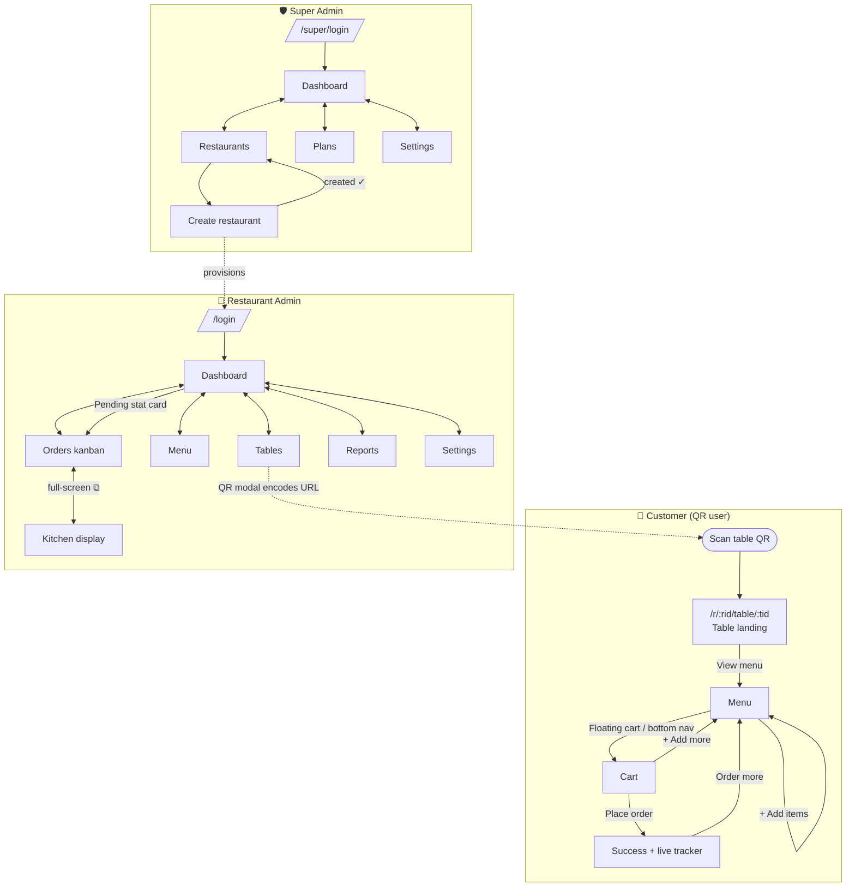
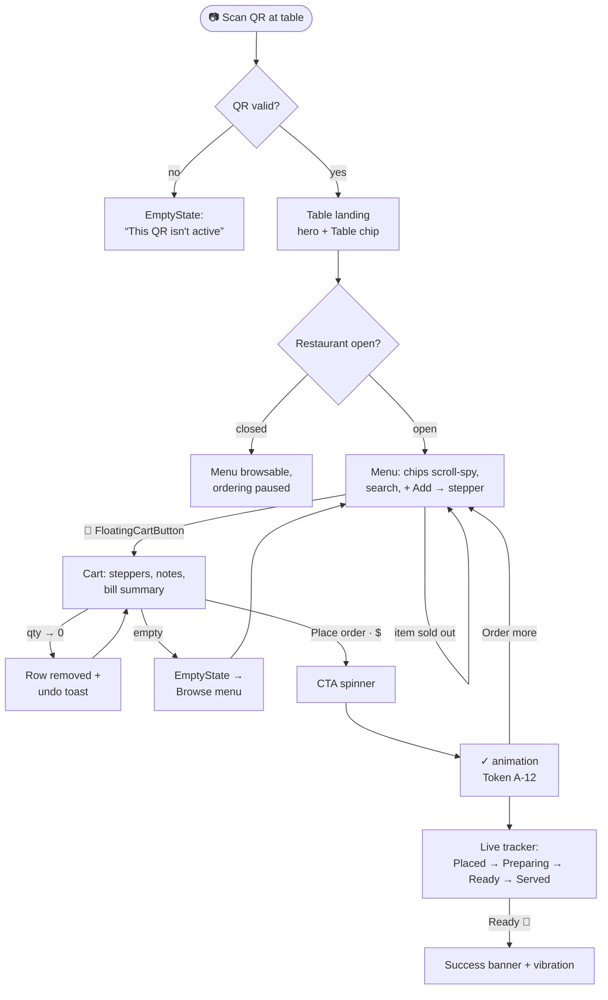
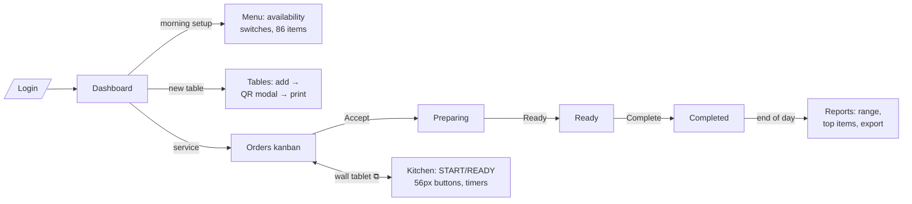
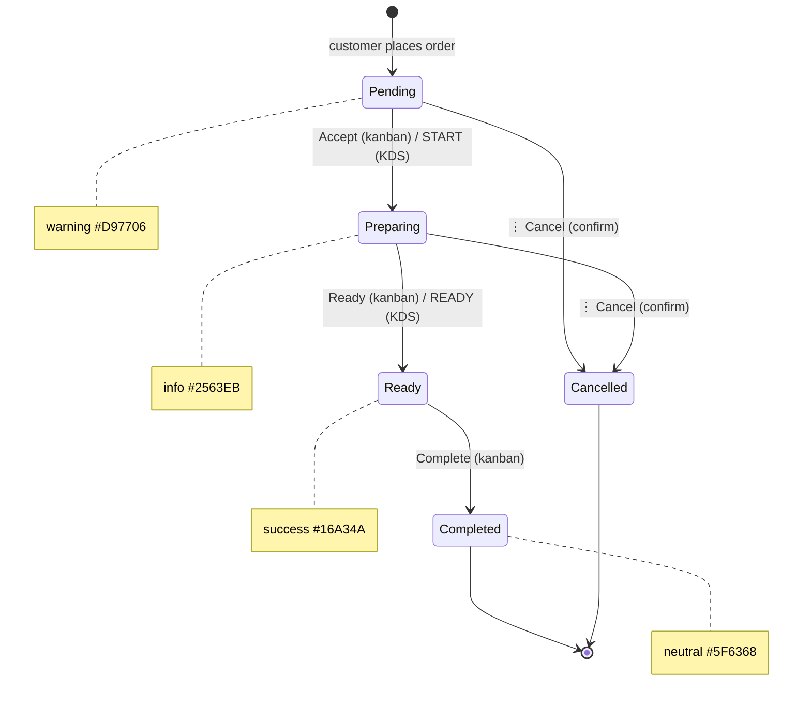
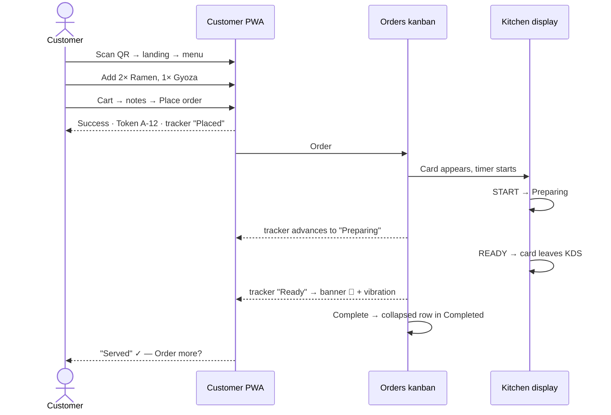
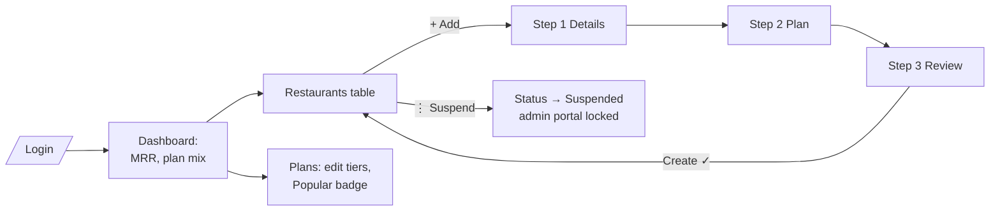

# Bear 360 — SaaS Restaurant Management MVP

**Production-ready UI architecture · React + Tailwind CSS + shadcn/ui · UI only (no backend)**

> **Demo-data note:** the implemented app now ships Indian demo data — restaurant
> "Masala Bear" (`/r/masala-bear/table/t-04`), a pan-Indian menu, ₹ (INR) pricing,
> and GST billing (CGST 2.5% + SGST 2.5%, configurable 5%/18% in settings).
> Wireframes below retain the original ramen-era example content; layout specs are
> unchanged.

---

## 0. Product overview & design decisions

Bear 360 is a QR-ordering and restaurant management SaaS with exactly three roles:

| Role | Surface | Device target | Feel |
|---|---|---|---|
| **Super Admin** | `/super/*` portal | Desktop first | Dense, data-heavy, calm |
| **Restaurant Admin** | `/*` portal | Desktop + tablet | Operational, fast, glanceable |
| **Customer (QR user)** | `/r/*` PWA | Mobile first | Warm, appetizing, one-thumb |

### Key design decisions (read first)

1. **Brand palette = yellow/black system.** Primary is `#F9EE4F` on near-black
   `#0B0807`, with warm browns for imagery surfaces. The green `#16A34A` from the
   original brief is **retained as the semantic success color** (order Ready,
   item Available, restaurant Active) — brand and status layers never compete.
2. **Dark chrome, light content.** Admin sidebars and the kitchen display use
   the dark `#0B0807` / `#2B1B12` surfaces to carry the brand's high-contrast
   identity; all content areas stay white/`#FCFDFD` for legibility.
3. **Two typefaces, strict roles.** Space Grotesk (700, tight tracking) for
   display: page titles, stat values, token numbers, restaurant names.
   Inter for everything else: body, labels, tables, inputs.
4. **UI-only MVP.** All screens render from mock fixtures in `src/lib/mock/`.
   Cart and order state live in React context + `localStorage`. No API calls,
   no database code — every data boundary is a typed fixture import.
5. **8px spacing grid, 16px cards, soft shadows, 1px `#E5EAEE` borders**
   everywhere. Pill (999px) primary buttons carry the brand CTA pattern.

---

## 1. Design system

### 1.1 Color tokens

#### Brand palette

| Token | Hex | Usage |
|---|---|---|
| `primary/500` | `#F9EE4F` | Primary CTAs, active nav indicator, highlights, brand marks |
| `primary/600` | `#F5E92A` | Primary hover |
| `primary/100` | `#FDFBDC` | Selected rows, subtle brand tints, chip backgrounds |
| `dark/900` | `#0B0807` | Sidebar, footer, KDS background, headline text |
| `dark/800` | `#2B1B12` | Dark cards, customer restaurant header, logo blocks |
| `dark/700` | `#5C3D20` | Image overlays, occupied-table tint |
| `bg` | `#FCFDFD` | Page background |
| `surface` | `#FFFFFF` | Cards, panels, sheets, popovers |
| `gray/100` | `#E5EAEE` | Card borders, dividers, input borders, skeleton base |
| `gray/50` | `#F1F4F7` | Table header rows, hover rows, muted fills |
| `text` | `#0B0807` | Primary text |
| `text-muted` | `#5F6368` | Secondary text, captions, placeholders |
| `blue/100` | `#B2D1FA` | Stat tile accents, info surfaces, chart secondary series |

#### Semantic palette

| Token | Hex | Tint (bg) | Usage |
|---|---|---|---|
| `success` | `#16A34A` | `#DCFCE7` | Ready orders, Available items, Active/Free states |
| `warning` | `#D97706` | `#FEF3C7` | Pending orders, expiring plans, low stock |
| `info` | `#2563EB` | `#DBEAFE` | Preparing orders, Trial plans, informational alerts |
| `danger` | `#DC2626` | `#FEE2E2` | Cancelled, Suspended, destructive actions, errors |
| `neutral` | `#5F6368` | `#F1F4F7` | Completed, Archived, Sold out, disabled |

#### CSS variables → shadcn/ui mapping

```css
:root {
  --background: #FCFDFD;      /* bg */
  --foreground: #0B0807;      /* text */
  --card: #FFFFFF;
  --card-foreground: #0B0807;
  --primary: #F9EE4F;
  --primary-foreground: #0B0807;   /* black text on yellow, always */
  --secondary: #F1F4F7;
  --secondary-foreground: #0B0807;
  --muted: #F1F4F7;
  --muted-foreground: #5F6368;
  --accent: #FDFBDC;
  --accent-foreground: #0B0807;
  --destructive: #DC2626;
  --border: #E5EAEE;
  --input: #E5EAEE;
  --ring: #F9EE4F;
  --radius: 1rem;             /* 16px cards */

  --sidebar: #0B0807;         /* dark chrome */
  --sidebar-foreground: #FCFDFD;
  --sidebar-accent: #2B1B12;
  --sidebar-primary: #F9EE4F;

  --success: #16A34A;
  --warning: #D97706;
  --info: #2563EB;
}
```

**Contrast rules:** yellow is never used for text; text on yellow is always
`#0B0807` (contrast ≈ 17:1). On dark surfaces, body text is `#FCFDFD`, muted
text is `rgba(252,253,253,0.64)`. Semantic colors are used for text only at
their 600+ weight on white.

### 1.2 Typography

Fonts: **Space Grotesk** (display) + **Inter** (UI), via Google Fonts.

| Style | Font | Size/Line | Weight | Tracking | Usage |
|---|---|---|---|---|---|
| Display | Space Grotesk | 48/56 | 700 | -0.03em | Token number, KDS timer, hero |
| H1 | Space Grotesk | 32/40 | 600 | -0.02em | Page titles |
| H2 | Space Grotesk | 24/32 | 600 | -0.02em | Section titles, modal titles |
| H3 | Inter | 20/28 | 600 | -0.01em | Card titles |
| Stat value | Space Grotesk | 28/36 | 700 | -0.02em | StatCard numbers |
| Body-lg | Inter | 16/24 | 400 | 0 | Customer PWA body, dialogs |
| Body | Inter | 14/20 | 400 | 0 | Default UI text, tables |
| Body-medium | Inter | 14/20 | 500 | 0 | Buttons, nav items, labels |
| Caption | Inter | 12/16 | 500 | 0 | Timestamps, helper text, badges |
| Overline | Inter | 11/16 | 600 | +0.06em, caps | Column headers, group labels |

```css
h1, h2, .display, .stat-value { font-family: 'Space Grotesk', sans-serif; }
body { font-family: 'Inter', sans-serif; }
```

### 1.3 Spacing — 8px system

Allowed steps: `4, 8, 12, 16, 24, 32, 40, 48, 64, 80` (12 only for icon↔label
and chip padding).

| Context | Value |
|---|---|
| Card padding | 24 desktop · 16 mobile |
| Gap between cards in a grid | 16 (dense) · 24 (dashboard) |
| Page padding (content area) | 32 desktop · 24 tablet · 16 mobile |
| Page title → content | 24 |
| Section → section | 32 |
| Form field vertical rhythm | 16 (label→input 8) |
| Icon → label | 8 · 12 in nav items |
| Table row height | 48 (dense 40) |
| Touch targets (customer PWA) | ≥ 44px |

### 1.4 Radius

| Element | Radius |
|---|---|
| Cards, modals, drawers, popovers | 16px (`rounded-2xl`) |
| Inputs, selects, small buttons | 10px |
| Primary/CTA buttons, chips, badges | 999px (pill) |
| Food images inside cards | 12px |
| Customer hero / marketing blocks | 24px |
| KDS cards | 16px |

### 1.5 Elevation & borders

```css
--shadow-card:   0 1px 2px rgba(11,8,7,0.04);
--shadow-raised: 0 4px 12px rgba(11,8,7,0.06);
--shadow-float:  0 10px 30px rgba(11,8,7,0.08);   /* modals, FAB, drawers */
```

- Every card: `border: 1px solid #E5EAEE` + `--shadow-card`.
- Hover-interactive cards: raise to `--shadow-raised`, border unchanged.
- Modals/drawers/floating cart: `--shadow-float`.
- Never shadow without border; never border-only inputs get `--ring` focus
  (2px yellow ring, 2px offset).

### 1.6 Breakpoints & containers

| Name | Range | Behavior anchor |
|---|---|---|
| Mobile | < 768px (`< md`) | Single column, bottom nav (customer), sticky CTAs |
| Tablet | 768–1279px (`md`–`lg`) | Collapsed icon sidebar, 2-col grids |
| Desktop | ≥ 1280px (`xl`) | Full sidebar, 4-col grids |

Content container: `max-width: 1440px`, centered, page padding per §1.3.
Customer PWA container: `max-width: 480px`, centered on larger screens with
`#FCFDFD` gutter.

---

## 2. App architecture

Single React SPA (Vite + React Router), three route trees sharing one design
system. UI-only: state is local + context, data is typed mock fixtures.

```
src/
├── app/
│   ├── router.tsx              # 3 route trees (super / admin / customer)
│   └── providers.tsx           # Theme, Toaster, CartProvider (customer)
│
├── layouts/
│   ├── AuthLayout.tsx          # Centered card on bg, logo top
│   ├── SuperAdminLayout.tsx    # Dark sidebar + TopHeader + <Outlet/>
│   ├── RestaurantAdminLayout.tsx # Collapsible dark sidebar + TopHeader
│   ├── KitchenLayout.tsx       # Full-screen dark, no sidebar/header
│   └── CustomerLayout.tsx      # Max-w 480, bottom nav (mobile), Outlet
│
├── features/
│   ├── super/
│   │   ├── login/SuperLoginPage.tsx
│   │   ├── dashboard/SuperDashboardPage.tsx
│   │   ├── restaurants/{RestaurantsPage,CreateRestaurantPage}.tsx
│   │   ├── plans/PlansPage.tsx
│   │   └── settings/SuperSettingsPage.tsx
│   ├── admin/
│   │   ├── login/LoginPage.tsx
│   │   ├── dashboard/DashboardPage.tsx
│   │   ├── tables/{TablesPage,QrPreviewModal}.tsx
│   │   ├── menu/{MenuPage,MenuItemDrawer}.tsx
│   │   ├── orders/{OrdersPage,OrderDetailSheet}.tsx
│   │   ├── kitchen/KitchenPage.tsx
│   │   ├── reports/ReportsPage.tsx
│   │   └── settings/SettingsPage.tsx
│   └── customer/
│       ├── landing/TableLandingPage.tsx    # /r/:restaurantId/table/:tableId
│       ├── menu/CustomerMenuPage.tsx
│       ├── cart/CartPage.tsx
│       └── success/SuccessPage.tsx
│
├── components/
│   ├── ui/                     # shadcn/ui primitives (button, card, dialog,
│   │                           #  drawer, sheet, table, tabs, badge, input,
│   │                           #  select, switch, skeleton, chart, sonner…)
│   └── app/                    # Product components (see §7)
│       ├── AppSidebar.tsx        ├── CategoryChip.tsx
│       ├── TopHeader.tsx         ├── FloatingCartButton.tsx
│       ├── StatCard.tsx          ├── StatusBadge.tsx
│       ├── ChartCard.tsx         ├── EmptyState.tsx
│       ├── TableCard.tsx         ├── LoadingSkeleton.tsx
│       ├── MenuItemCard.tsx      ├── QuantityStepper.tsx
│       ├── OrderCard.tsx         └── PageHeader.tsx
│       └── KitchenCard.tsx
│
├── lib/
│   ├── utils.ts                # cn()
│   ├── status.ts               # status→color maps (single source of truth)
│   └── mock/                   # restaurants.ts, menu.ts, orders.ts,
│                               # tables.ts, plans.ts, stats.ts
├── hooks/
│   ├── use-cart.ts             # context: items, qty, notes, totals
│   ├── use-sidebar.ts          # collapsed state, persisted
│   └── use-media-query.ts
└── styles/globals.css          # tokens from §1.1, font imports
```

**State boundaries (UI-only):**
- Auth = mock: login pages navigate on submit; a `RoleGuard` wrapper simply
  redirects unknown paths to the right login (placeholder for future auth).
- Cart = `CartProvider` (context + localStorage), scoped per
  `restaurantId/tableId`.
- Order status on Success page = simulated stepper (timed mock transitions).
- All lists/charts read from `lib/mock/*` fixtures typed with TS interfaces.

---

## 3. Route structure

| Route | Layout | Screen | Notes |
|---|---|---|---|
| **Super Admin** | | | |
| `/super/login` | AuthLayout | Super login | Dark-brand auth card |
| `/super/dashboard` | SuperAdminLayout | Platform dashboard | Default after login |
| `/super/restaurants` | SuperAdminLayout | Restaurants data table | Filters via URL params |
| `/super/restaurants/create` | SuperAdminLayout | Create restaurant (3-step) | Also edit via `/:id/edit` (same screen) |
| `/super/plans` | SuperAdminLayout | Plans management | Card grid + edit dialog |
| `/super/settings` | SuperAdminLayout | Platform settings | Tabs |
| **Restaurant Admin** | | | |
| `/login` | AuthLayout | Admin login | |
| `/dashboard` | RestaurantAdminLayout | Restaurant dashboard | Default after login |
| `/tables` | RestaurantAdminLayout | Tables grid + QR | QR modal is route-less state |
| `/menu` | RestaurantAdminLayout | Menu management | `?category=` in URL |
| `/orders` | RestaurantAdminLayout | Orders kanban | `?status=` deep-link |
| `/kitchen` | KitchenLayout | Kitchen display | Full-screen, dark |
| `/reports` | RestaurantAdminLayout | Reports | `?from=&to=` range in URL |
| `/settings` | RestaurantAdminLayout | Restaurant settings | Tabs |
| **Customer PWA** | | | |
| `/r/:restaurantId/table/:tableId` | CustomerLayout | Table landing | Scans land here; stores context |
| `/r/:restaurantId/table/:tableId/menu` | CustomerLayout | Menu browse | Bottom nav: Menu |
| `/r/:restaurantId/table/:tableId/cart` | CustomerLayout | Cart & checkout | Bottom nav: Cart |
| `/r/:restaurantId/table/:tableId/success` | CustomerLayout | Order success + tracker | Bottom nav: Status |
| `*` | — | 404 | EmptyState, "Back to home" |

Customer sub-routes stay nested under the scanned table URL so refresh never
loses restaurant/table context (the QR encodes the full landing URL).

---

## 4. Navigation structure

### 4.1 Super Admin — dark sidebar (fixed 264px desktop)

```
┌ Sidebar (#0B0807) ────────┐
│ 🐻 Bear 360  SUPER          │   Logo block 64px, border-b white/8%
│                           │
│ ▸ Dashboard               │   Items 40px, radius 10, Inter 14/500
│ ▸ Restaurants             │   Active: #2B1B12 bg + 3px #F9EE4F left bar
│ ▸ Plans                   │   Inactive text: white/64% → white on hover
│ ▸ Settings                │
│        (spacer)           │
│ ● Anya A.  Super Admin  ⏻ │   User block pinned bottom, 64px
└───────────────────────────┘
```

### 4.2 Restaurant Admin — collapsible dark sidebar (264px ↔ 72px)

Sections with Overline group labels; collapse control in TopHeader.

```
GENERAL          OPERATIONS        INSIGHTS
▸ Dashboard      ▸ Tables          ▸ Reports
                 ▸ Menu            ▸ Settings
                 ▸ Orders   (3)●   ← count badge, yellow pill
                 ▸ Kitchen  ⧉      ← opens full-screen layout
```

- Collapsed (tablet default): 72px, icons only, tooltips on hover, logo mark
  only. Mobile: sidebar becomes a left Sheet (overlay) opened by ☰.
- Kitchen item styled with an "external" glyph — it exits the shell.

### 4.3 TopHeader (both admin portals) — 64px, white, border-b

`[☰ collapse] [Breadcrumb / Page context] ······ [Search ⌘K] [🔔 dot] [Avatar ▾]`

- Super admin search = global (restaurants, owners). Restaurant admin search =
  menu items, orders, tables. `⌘K` opens a shadcn Command palette.
- Avatar menu: Profile, Settings, Log out.

### 4.4 Customer PWA navigation

- **Top:** restaurant header (dark `#2B1B12` block) with name, table chip.
- **Sticky category chips** under the header while scrolling the menu.
- **Bottom nav (mobile, 64px + safe-area):** `Menu · Cart (badge) · Status` —
  active item yellow icon + label, inactive `#5F6368`.
- **FloatingCartButton:** appears above bottom nav once cart > 0 (menu screen).
- ≥ 768px: PWA renders centered at 480px; bottom nav persists (kiosk-friendly).

---

## 5. Screen list

| # | Portal | Screen | Route |
|---|---|---|---|
| 1 | Super | Login | `/super/login` |
| 2 | Super | Dashboard | `/super/dashboard` |
| 3 | Super | Restaurants | `/super/restaurants` |
| 4 | Super | Create restaurant | `/super/restaurants/create` |
| 5 | Super | Plans | `/super/plans` |
| 6 | Super | Settings | `/super/settings` |
| 7 | Admin | Login | `/login` |
| 8 | Admin | Dashboard | `/dashboard` |
| 9 | Admin | Tables | `/tables` |
| 10 | Admin | Menu | `/menu` |
| 11 | Admin | Orders | `/orders` |
| 12 | Admin | Kitchen display | `/kitchen` |
| 13 | Admin | Reports | `/reports` |
| 14 | Admin | Settings | `/settings` |
| 15 | Customer | Table landing | `/r/:rid/table/:tid` |
| 16 | Customer | Menu | `…/menu` |
| 17 | Customer | Cart | `…/cart` |
| 18 | Customer | Success & tracking | `…/success` |

---

## 6. Detailed screen layouts

Wireframes are desktop-first; responsive deltas follow each screen.
`pad` = padding, `g` = gap, all values in px on the 8px grid.

---

### 6.1 Super Admin — Login `/super/login`

```
┌──────────────────────── AuthLayout (bg #FCFDFD) ────────────────────────┐
│                                                                         │
│                          🐻 Bear 360  ·  SUPER ADMIN        (Overline)    │
│            ┌────────────── Card 400w, pad 32 ──────────────┐            │
│            │  H2  Sign in to Bear 360                        │            │
│            │  Caption  Platform administration             │  g 24      │
│            │  Label Email      [ input 40h            ]    │  g 16      │
│            │  Label Password   [ input 40h         👁 ]    │            │
│            │  [        Sign in  (pill, yellow, 44h)   ]    │  g 24      │
│            │  Caption center: Forgot password?             │            │
│            └───────────────────────────────────────────────┘            │
└─────────────────────────────────────────────────────────────────────────┘
```

- **Hierarchy:** `AuthLayout > Card > form(Label+Input ×2, Button, link)`
- **States:** error → destructive `Alert` inline above fields; submitting →
  button spinner + disabled. No empty state.
- **Responsive:** card `w-full mx-16` under 480px; identical otherwise.
- Restaurant Admin login (§6.7) reuses this screen 1:1 minus the SUPER badge.

---

### 6.2 Super Admin — Dashboard `/super/dashboard`

```
┌ Sidebar ┬──────────────────── TopHeader 64h ─────────────────────────────┐
│ 264px   ├────────────────────────────────────────────────────────────────┤
│ dark    │ pad 32                                                         │
│         │ H1 Dashboard                    [Last 30 days ▾] [⤓ Export]    │
│         │                                                       g 24     │
│         │ ┌ Stat ─────┐┌ Stat ─────┐┌ Stat ─────┐┌ Stat ─────┐  g 16     │
│         │ │ Restaurants││ MRR       ││ Orders    ││ Active    │           │
│         │ │ 128        ││ $12,480   ││ 45.2k     ││ tables 940│           │
│         │ │ ▲ 12% ↗    ││ ▲ 8% ↗    ││ ▼ 3% ↘    ││ ▲ 5% ↗    │           │
│         │ └───────────┘└───────────┘└───────────┘└───────────┘           │
│         │                                                       g 24     │
│         │ ┌ ChartCard  Revenue (8 cols) ───────┐┌ ChartCard (4) ┐        │
│         │ │ H3 Revenue        [Monthly ▾]      ││ H3 Plan mix   │        │
│         │ │  area chart 280h, yellow fill      ││ donut 200Ø    │        │
│         │ │  x: months   y: $                  ││ legend list   │        │
│         │ └────────────────────────────────────┘└───────────────┘        │
│         │                                                       g 24     │
│         │ ┌ Card  Recent restaurants ──────────────────────────┐         │
│         │ │ H3 Recent restaurants               View all →     │         │
│         │ │ table: Name · Owner · Plan · Status · Created · ⋮  │         │
│         │ │ 5 rows, 48h, StatusBadge in Status col             │         │
│         │ └────────────────────────────────────────────────────┘         │
└─────────┴────────────────────────────────────────────────────────────────┘
```

- **Hierarchy:** `SuperAdminLayout > PageHeader > StatCard×4 >
  grid-cols-12 (ChartCard-revenue span-8 + ChartCard-donut span-4) >
  Card > Table + StatusBadge`
- **StatCard anatomy:** 24 pad; icon tile 40×40 radius 12 (`blue/100` bg,
  dark icon); Caption label; Stat value (Space Grotesk 28/700); delta Caption
  in success/danger with arrow.
- **Charts:** Recharts via shadcn chart; primary series `#F9EE4F` (area with
  20% fill), secondary `#B2D1FA`; grid lines `#E5EAEE`; donut segments:
  yellow, blue/100, dark/800, gray/100.
- **States:** loading → 4 skeleton stat cards + skeleton chart (280h) +
  5 skeleton rows. Empty (new platform) → charts show EmptyState "No data
  yet — create your first restaurant" with CTA. Error → inline Alert + Retry
  per card (cards fail independently).
- **Responsive:** tablet stats 2×2, charts stack full-width; mobile 1-col,
  table becomes stacked rows (Name+Status line, meta Caption line).

---

### 6.3 Super Admin — Restaurants `/super/restaurants`

```
│ H1 Restaurants  Caption 128 total          [+ Add restaurant (pill)]   │
│                                                                 g 24   │
│ ┌ Card ──────────────────────────────────────────────────────────────┐ │
│ │ [🔎 Search name/owner]  [Plan ▾] [Status ▾] [Sort: Newest ▾]  ⟲    │ │  toolbar 64h
│ ├────────────────────────────────────────────────────────────────────┤ │
│ │ □ | Restaurant        | Owner        | Plan    | Status   | MRR | ⋮│ │  Overline header, gray/50
│ │ □ | 🍜 Noodle Bear    | R. Sharma    | Pro     | ●Active  | $99 | ⋮│ │  rows 56h
│ │ □ | 🍕 Slice House    | M. Chen      | Starter | ●Trial   | $0  | ⋮│ │
│ │ □ | 🌮 Taco Verde     | A. Gómez     | Pro     | ●Suspended $99 | ⋮│ │
│ ├────────────────────────────────────────────────────────────────────┤ │
│ │ Showing 1–10 of 128                 [◀ Prev] [1][2][3] [Next ▶]    │ │  footer 56h
│ └────────────────────────────────────────────────────────────────────┘ │
```

- **Hierarchy:** `PageHeader(+CTA) > Card > TableToolbar(Input, Select×2,
  reset) > DataTable(Checkbox, avatar+name, cells, StatusBadge,
  DropdownMenu) > TablePagination`
- **Row action menu (⋮):** View, Edit, Copy QR base URL, — divider —
  Suspend/Activate (warning), Delete (danger, confirm dialog).
- **Bulk bar:** selecting rows swaps toolbar for `N selected · [Suspend]
  [Export] [✕]` on `primary/100` background.
- **Status column:** StatusBadge — Active/success, Trial/info,
  Suspended/danger, Expired/neutral.
- **States:** empty → EmptyState in table body (storefront illustration,
  "No restaurants yet", CTA + Add restaurant); filtered-empty → "No matches —
  clear filters"; loading → toolbar live + 8 skeleton rows; error → Alert
  row with Retry.
- **Responsive:** tablet hides MRR + Owner (in row subtitle); mobile → cards
  list (name, plan·owner Caption, StatusBadge right, ⋮), filters in a Sheet
  behind a [Filters] button, Add becomes FAB-style full-width sticky button.

---

### 6.4 Super Admin — Create restaurant `/super/restaurants/create`

```
│ ← Restaurants   H1 Create restaurant                                   │
│ ┌ Stepper: (1)● Details ── (2)○ Plan ── (3)○ Review ┐        g 24      │
│ ┌ Card 720w centered, pad 32 ────────────────────────────────┐         │
│ │ STEP 1 · DETAILS (Overline)                                │         │
│ │ [ Logo upload 96×96 dashed, radius 16 ]  "PNG/JPG, 1MB"    │  g 24   │
│ │ Restaurant name  [___________]   Slug  [bear360.app/r/____] │  2-col  │
│ │ Owner name       [___________]   Owner email [__________]  │  g 16   │
│ │ Phone            [___________]   City        [__________]  │         │
│ ├────────────────────────────────────────────────────────────┤         │
│ │ STEP 2 · PLAN: RadioGroup of 3 plan cards (radius 16,      │         │
│ │   selected = yellow 2px border + primary/100 bg + ✓)       │         │
│ │   name · $/mo · 3 feature bullets each                     │         │
│ ├────────────────────────────────────────────────────────────┤         │
│ │ STEP 3 · REVIEW: summary list (label/value rows, 40h) +    │         │
│ │   "Send invite email to owner" Switch                      │         │
│ ├────────────────────────────────────────────────────────────┤         │
│ │ footer: [Cancel]            [← Back] [Continue → (yellow)] │  64h    │
│ └────────────────────────────────────────────────────────────┘         │
```

- **Hierarchy:** `PageHeader(back) > Stepper > Card > StepPanel(form grid) >
  FormFooter`
- **Validation UI:** inline field errors (Caption danger below input,
  danger border); Continue disabled until step valid.
- **Success:** toast "Noodle Bear created" → navigate to `/super/restaurants`
  with new row highlighted `primary/100` for 2s.
- **Responsive:** form grid → 1-col under 768px; stepper compresses to
  "Step 1 of 3" Caption + progress bar; footer sticky bottom on mobile.

---

### 6.5 Super Admin — Plans `/super/plans`

```
│ H1 Plans   Caption Manage subscription tiers      [+ New plan (pill)]  │
│ ┌ PlanCard ─────────┐┌ PlanCard ─────────┐┌ PlanCard (dark) ──┐  g 24  │
│ │ Overline STARTER  ││ PRO  [Popular]    ││ ENTERPRISE        │        │
│ │ $29 /mo (Display) ││ $99 /mo           ││ Custom            │        │
│ │ ✓ 10 tables       ││ ✓ Unlimited tables││ ✓ Multi-branch    │        │
│ │ ✓ 50 menu items   ││ ✓ Kitchen display ││ ✓ SLA support     │        │
│ │ ✓ Basic reports   ││ ✓ Full reports    ││ ✓ Custom domain   │        │
│ │ 42 restaurants    ││ 71 restaurants    ││ 15 restaurants    │        │
│ │ [Edit] [Archive]  ││ [Edit] [Archive]  ││ [Edit] [Archive]  │        │
│ └───────────────────┘└───────────────────┘└───────────────────┘        │
```

- **Hierarchy:** `PageHeader(+CTA) > grid-cols-3 > PlanCard(Overline, price
  Display, feature list ✓ success icons, usage Caption, footer buttons)`
- "Popular" = yellow pill badge; Enterprise card uses `dark/800` bg, white
  text (brand dark-card moment). Edit opens a Dialog with the same fields;
  Archive → confirm dialog (danger).
- **States:** loading → 3 skeleton cards; empty → EmptyState + New plan;
  archive error → toast destructive.
- **Responsive:** tablet 2-col (third wraps), mobile 1-col.

---

### 6.6 Super Admin — Settings `/super/settings`

```
│ H1 Settings                                                            │
│ Tabs: [General] [Team] [Billing defaults] [Notifications]     g 24     │
│ ┌ Card pad 32, max-w 720 ────────────────────────────────────┐         │
│ │ H3 Platform identity                                       │         │
│ │ Platform name [Bear 360    ]   Support email [_________]     │         │
│ │ Logo [96×96 upload]                                        │         │
│ │ ── divider 24 ──                                           │         │
│ │ H3 Danger zone (Caption danger)                            │         │
│ │ "Suspend all trials"  [Suspend… (outline danger)]          │         │
│ ├────────────────────────────────────────────────────────────┤         │
│ │ sticky footer: unsaved-changes bar [Discard] [Save (pill)] │         │
│ └────────────────────────────────────────────────────────────┘         │
```

- **Team tab:** members table (name, role Select, remove) + Invite dialog.
- **Notifications tab:** Switch rows, 48h each, divider between.
- **States:** save → footer bar appears only when dirty; success toast;
  loading → skeleton form (label+input bars).
- **Responsive:** tabs scroll horizontally on mobile; 2-col fields stack.

---

### 6.7 Restaurant Admin — Login `/login`

Identical layout to §6.1 with restaurant branding: logo mark, H2 "Welcome
back", Caption "Sign in to manage your restaurant". Below the card:
Caption "Powered by 🐻 Bear 360".

---

### 6.8 Restaurant Admin — Dashboard `/dashboard`

```
│ H1 Good morning, Noodle Bear  Caption Thu, Aug 7      [+ Quick action ▾]│
│ ┌Stat Today's orders┐┌Stat Revenue┐┌Stat Pending ┐┌Stat Completed┐ g 16 │
│ │ 47  ▲ 12%         ││ $1,284 ▲8% ││ 6  (warning)││ 38 (success) │      │
│ └───────────────────┘└────────────┘└─────────────┘└──────────────┘      │
│                                                                  g 24   │
│ ┌ ChartCard  Sales today (span 8) ─────────┐┌ Card Popular (4) ─┐       │
│ │ H3 Sales    [Today|Week|Month] segmented │ │ H3 Popular items │       │
│ │ bar chart 260h, hourly buckets, yellow   │ │ 1. 🍜 Ramen  ×32 │       │
│ │                                          │ │ 2. 🥟 Gyoza  ×21 │  rows │
│ │                                          │ │ 3. 🍛 Curry  ×18 │  48h  │
│ └──────────────────────────────────────────┘└───────────────────┘       │
│                                                                  g 24   │
│ ┌ Card Recent activity (span 8) ───────────┐┌ Card Quick (4) ───┐       │
│ │ feed rows 48h: icon tile + text + time   ││ 2×2 action tiles: │       │
│ │ "Order #128 placed · Table 4 · 2m ago"   ││ [+ Menu item]     │       │
│ │ "Order #127 ready · Table 2 · 6m ago"    ││ [+ Table]         │       │
│ │ View all →                               ││ [View orders]     │       │
│ │                                          ││ [Open kitchen ⧉]  │       │
│ └──────────────────────────────────────────┘└───────────────────┘       │
```

- **Hierarchy:** `PageHeader > StatCard×4 > grid-12(ChartCard span-8 +
  PopularItemsCard span-4) > grid-12(ActivityCard span-8 +
  QuickActionsCard span-4)`
- Pending StatCard uses warning tint icon tile; clicking it deep-links to
  `/orders?status=pending`. Quick action tiles: 96h, radius 16, gray/50 bg,
  hover primary/100, icon + Body-medium.
- **States:** loading → skeleton stats/chart/rows; empty (no orders today) →
  chart EmptyState "No sales yet today" + Popular "Orders will appear here";
  error → per-card Alert + Retry.
- **Responsive:** tablet stats 2×2 and cards stack (8/4 → full width);
  mobile 1-col, Quick actions become 2×2 compact 80h tiles.

---

### 6.9 Restaurant Admin — Tables `/tables`

```
│ H1 Tables  Caption 12 tables · 7 occupied        [+ Add table (pill)]  │
│ [All (12)] [Free (5)] [Occupied (7)]   ← segmented filter     g 24     │
│ ┌ TableCard ┐┌ TableCard ┐┌ TableCard ┐┌ TableCard ┐   4-col, g 16     │
│ │ T-01      ││ T-02      ││ T-03      ││ T-04      │                    │
│ │ ●Occupied ││ ●Free     ││ ●Occupied ││ ●Free     │                    │
│ │ 4 seats   ││ 2 seats   ││ 6 seats   ││ 4 seats   │                    │
│ │ #128 ·$42 ││           ││ #131 ·$18 ││           │  ← active order    │
│ │ [QR] [⋮]  ││ [QR] [⋮]  ││ [QR] [⋮]  ││ [QR] [⋮]  │                    │
│ └───────────┘└───────────┘└───────────┘└───────────┘                    │
```

**QR preview modal (Dialog 400w):**

```
│ H2 Table T-03 · QR code                       ✕ │
│   ┌──────────── QR 240×240, radius 16 ────────┐ │
│   │  (yellow border frame, 🐻 mark center)    │ │
│   └───────────────────────────────────────────┘ │
│   Caption bear360.app/r/masala-bear/table/t-03   │
│   [⤓ Download PNG (pill)]  [🖨 Print]  [Copy 🔗] │
```

- **Hierarchy:** `PageHeader(+CTA) > SegmentedFilter > grid > TableCard
  (name H3 Space Grotesk, StatusBadge, seats Caption, active-order strip,
  footer buttons) > QrPreviewModal(Dialog)`
- **TableCard states:** Free = white bg + success-dot badge; Occupied =
  `#FDF6EC` warm tint bg (dark/700 at 6%) + warning-dot badge + order strip
  (order # + running total, links to order).
- **⋮ menu:** Rename, Change seats, — Mark free (if occupied, confirm),
  Delete (danger).
- **States:** empty → EmptyState "No tables yet — add your first table to
  generate its QR" + CTA; loading → 8 skeleton cards (grid); error → Alert +
  Retry.
- **Responsive:** 4-col → 2-col tablet → 1-col mobile (cards become 72h
  horizontal rows: name+badge left, QR button right); Add table sticky
  bottom on mobile.

---

### 6.10 Restaurant Admin — Menu `/menu`

```
│ H1 Menu  Caption 48 items · 6 categories        [+ Add item (pill)]    │
│ Tabs: [All] [Ramen] [Sides] [Drinks] [Desserts] [+]  [🔎 Search…]      │
│                                                       g 24             │
│ □ Select all   ← appears with selection: N selected [Set available]    │
│                  [Set sold out] [Change category] [Delete]             │
│ ┌ MenuItemCard ─────┐┌ MenuItemCard ─────┐┌ MenuItemCard ─────┐ 3-col  │
│ │ ┌ img 16:9 r12 ┐  ││                   ││                   │  g 16  │
│ │ └──────────────┘  ││                   ││                   │        │
│ │ Tonkotsu Ramen    ││ …                 ││ …                 │        │
│ │ Caption Rich pork ││                   ││                   │        │
│ │ $12.50   [◉ ] Avl ││                   ││                   │        │
│ │           ✎  ⋮    ││                   ││                   │        │
│ └───────────────────┘└───────────────────┘└───────────────────┘        │
```

**Add/Edit item drawer (Sheet right, 480w):**

```
│ H2 Add menu item                              ✕ │
│ [ Image upload 16:9 dashed r12 ]                │
│ Name [__________]        Price [$ ____]         │
│ Category [Select ▾]      Veg/Non-veg [Toggle]   │
│ Description [textarea 3 rows]                   │
│ Available [Switch ◉]                            │
│ footer sticky: [Cancel] [Save item (pill)]      │
```

- **Hierarchy:** `PageHeader(+CTA) > Tabs+SearchInput > BulkActionBar >
  grid > MenuItemCard(img, name H3, desc Caption 1-line, price Body-medium,
  AvailabilitySwitch, hover: edit/⋮) > MenuItemDrawer(Sheet)`
- **Availability switch:** on = success track; off dims card to 60% + "Sold
  out" neutral StatusBadge over image. Instant optimistic toggle + toast.
- **Category tabs:** shadcn Tabs underline style, count Caption per tab,
  `[+]` opens small "New category" popover; tabs scroll horizontally with
  edge fade when overflowing.
- **States:** empty (no items) → EmptyState bowl illustration "Your menu is
  empty — add your first dish" + CTA; empty search → "No dishes match
  '…'" + Clear; loading → 6 skeleton cards (img block + 2 lines + row);
  error → Alert + Retry.
- **Responsive:** 3-col → 2-col tablet → 1-col mobile (horizontal card:
  96×96 img left, content right, switch far right); drawer becomes
  full-screen Sheet bottom on mobile; Add item sticky bottom.

---

### 6.11 Restaurant Admin — Orders `/orders`

```
│ H1 Orders  Caption Live board      [Today ▾] [🔎 #order/table]         │
│ ┌ Sticky summary bar 48h, gray/50, radius 12 ──────────────────────┐   │
│ │ ● 6 Pending   ● 4 Preparing   ● 3 Ready   ● 38 Completed  $1,284 │   │
│ └───────────────────────────────────────────────────────────────────┘   │
│ ┌ PENDING(6) ─┐ ┌ PREPARING(4)┐ ┌ READY(3) ──┐ ┌ COMPLETED(38)┐  g 16  │
│ │ warning bar │ │ info bar    │ │ success bar│ │ neutral bar  │  cols  │
│ │┌ OrderCard ┐│ │┌───────────┐│ │┌──────────┐│ │┌────────────┐│  320w  │
│ ││#132 Table 4│ ││#130 Table 2│ ││#128 Tbl 1 ││ ││#127 Tbl 6  ││        │
│ ││2m ago ⏱   ││ ││8m         ││ ││12m        ││ ││Paid ✓      ││        │
│ ││2× Ramen   ││ ││…          ││ ││…          ││ ││collapsed   ││        │
│ ││1× Gyoza   ││ ││           ││ ││           ││ ││rows        ││        │
│ ││$31.00     ││ ││           ││ ││           ││ ││            ││        │
│ ││[Accept →] ││ ││[Ready →]  ││ ││[Complete] ││ ││            ││        │
│ │└───────────┘│ │└───────────┘│ │└──────────┘│ │└────────────┘│        │
│ └─────────────┘ └─────────────┘ └────────────┘ └──────────────┘        │
```

- **Hierarchy:** `PageHeader > OrdersSummaryBar(sticky) > KanbanBoard >
  KanbanColumn×4(header: Overline title+count, 3px top status bar) >
  OrderCard(order# Body-medium, table chip, elapsed Caption, item lines,
  total, advance Button) > OrderDetailSheet`
- **OrderCard:** 16 pad, radius 16; elapsed time turns warning at 10m,
  danger at 20m (Pending/Preparing only); primary action advances one
  column (single-direction flow), ⋮ offers Cancel (danger, confirm) and
  Print KOT. Click anywhere else → OrderDetailSheet (items, notes, timeline,
  table, totals).
- **Columns:** independently scrollable (`max-h: calc(100vh − 240px)`);
  Completed cards render collapsed (single row: # · table · $ · time).
- **New order arrival:** card slides into Pending with `primary/100` flash
  2s + subtle badge pulse on summary bar.
- **States:** all-empty → full-board EmptyState "No orders yet — orders from
  table QRs appear here live"; per-column empty → dashed placeholder
  "Nothing pending 🎉" Caption; loading → 4 columns × 2 skeleton cards;
  error → board-level Alert + Retry.
- **Responsive:** tablet → 2 columns visible, horizontal scroll with snap;
  mobile → segmented status switcher (Pending·Preparing·Ready·Done) above a
  single column list; summary bar sticks under the switcher.

---

### 6.12 Restaurant Admin — Kitchen display `/kitchen`

Full-screen `KitchenLayout`, dark theme — designed for a wall tablet/TV.

```
┌ bg #0B0807, pad 24 ──────────────────────────────────────────────────────┐
│ 🐻 KITCHEN — NOODLE BEAR      ⟳ Live · updated 5s ago      [Exit ⛶]     │
│ Overline white/64                (pulsing success dot)                   │
│ ┌ KitchenCard ────────┐┌ KitchenCard ────────┐┌ KitchenCard ────┐ 3-col │
│ │ #132   TABLE 4      ││ #130   TABLE 2      ││ #128   TABLE 1  │ g 16  │
│ │ ⏱ 02:41 (Display)   ││ ⏱ 08:12 (warning)   ││ ⏱ 12:05 (danger)│       │
│ │ ───────────────     ││                     ││                 │       │
│ │ 2× Tonkotsu Ramen   ││ 1× Veg Curry        ││ 3× Gyoza        │       │
│ │    — no egg (note)  ││ 2× Green Tea        ││ 1× Ramen        │       │
│ │ 1× Gyoza            ││                     ││                 │       │
│ │ [START (yellow 56h)]││ [READY (success 56h)││ [READY]         │       │
│ └─────────────────────┘└─────────────────────┘└─────────────────┘       │
└──────────────────────────────────────────────────────────────────────────┘
```

- **Hierarchy:** `KitchenLayout > KdsHeader(title, AutoRefreshIndicator,
  exit) > grid > KitchenCard(header row, TimerDisplay, divider, item list,
  action Button)`
- **KitchenCard:** bg `#2B1B12`, border white/8%, radius 16, pad 24; text
  `#FCFDFD` at Body-lg (16/24) minimum — high contrast at 3m distance.
  Item quantities bold 20/28; notes italic `#F9EE4F`.
- **Timer:** Space Grotesk 32/700, white → warning ≥ 8m → danger ≥ 12m
  (card border tints to match). Cards sorted oldest-first.
- **Flow:** shows Pending + Preparing only. `START` (yellow) → Preparing;
  `READY` (success, white text) → card flies out; Ready orders leave the KDS.
- **Auto-refresh indicator:** pulsing success dot + "updated Ns ago"
  Caption (mock interval tick).
- **States:** empty → centered dark EmptyState "All caught up 👨‍🍳" white/64;
  loading → 3 dark skeleton cards (white/8 shimmer); connection error →
  danger banner top "Reconnecting…" + spinner.
- **Responsive:** 3-col ≥1280 → 2-col tablet → 1-col mobile; buttons never
  under 56h (glove-friendly).

---

### 6.13 Restaurant Admin — Reports `/reports`

```
│ H1 Reports          [Aug 1 – Aug 7 ▾ (range picker)] [⤓ Export CSV]    │
│ ┌Stat Revenue $8.4k┐┌Stat Orders 312┐┌Stat Avg $27┐┌Stat Top: Ramen┐   │
│                                                                  g 24  │
│ ┌ ChartCard Revenue (span 7) ─────────┐┌ ChartCard Orders (5) ──┐      │
│ │ area chart 280h daily, yellow       ││ bar chart 280h by day  │      │
│ │ prev-period ghost line #B2D1FA      ││                        │      │
│ └─────────────────────────────────────┘└────────────────────────┘      │
│ ┌ Card Top items (span 7) ────────────┐┌ Card By category (5) ──┐      │
│ │ rank · item · qty · revenue · trend ││ donut + legend         │      │
│ │ 10 rows, mini bar per row (yellow)  ││                        │      │
│ └─────────────────────────────────────┘└────────────────────────┘      │
```

- **Hierarchy:** `PageHeader(DateRangePicker, Export) > StatCard×4 >
  grid-12(ChartCard span-7 + span-5) > grid-12(TopItemsTable span-7 +
  DonutCard span-5)`
- **DateRangePicker:** shadcn Popover + Calendar, presets column (Today,
  7 days, 30 days, This month, Custom). Changing range animates charts.
- **States:** empty range → EmptyState in each chart "No data in this
  range"; loading → skeleton stats + 2 skeleton charts + skeleton table;
  error → per-card Alert + Retry.
- **Responsive:** tablet: charts stack full-width, stats 2×2; mobile:
  1-col, range picker full-width, table hides trend column.

---

### 6.14 Restaurant Admin — Settings `/settings`

```
│ H1 Settings                                                            │
│ Tabs: [Profile] [Service] [QR & branding] [Notifications] [Billing]    │
│ ┌ Card max-w 720, pad 32 ────────────────────────────────────┐         │
│ │ Profile: logo upload, name, address, phone, cuisine tags   │         │
│ │ Service: opening hours rows (day + 2 time selects +        │         │
│ │   closed Switch), service charge %, currency Select        │         │
│ │ QR & branding: accent preview, QR frame style, re-download │         │
│ │   all QRs button                                           │         │
│ │ Notifications: Switch rows (new order sound, daily digest) │         │
│ │ Billing: current PlanCard mini + "Contact support" — read  │         │
│ │   only for MVP                                             │         │
│ └────────────────────────────────────────────────────────────┘         │
│ sticky dirty-state footer: [Discard] [Save changes (pill)]             │
```

- Same patterns as §6.6 (dirty-footer, skeleton form, toast on save).
- **Responsive:** tabs scroll horizontally; hour rows wrap to 2 lines.

---

### 6.15 Customer — Table landing `/r/:restaurantId/table/:tableId`

The screen a scan opens. Warm brand moment, one action.

```
┌ CustomerLayout, max-w 480 ────────────────┐
│ ┌ Hero card, bg #2B1B12, r24, pad 24 ──┐  │
│ │ (cover img, #5C3D20 overlay 60%)     │  │
│ │ 🍜 logo 56×56 r16                    │  │
│ │ Noodle Bear (Space Grotesk 24/700,   │  │
│ │   white)                             │  │
│ │ ★ 4.6 · Open now (success dot)       │  │
│ │ [ Table 4 ] yellow pill chip         │  │
│ └──────────────────────────────────────┘  │
│  g 24                                     │
│ H3 Welcome! 👋                            │
│ Body-lg Browse the menu and order         │
│   directly from your table.               │
│  g 24                                     │
│ [ View menu  (yellow pill, 52h, full) ]   │
│ Caption center: Powered by 🐻 Bear 360      │
└───────────────────────────────────────────┘
```

- **Hierarchy:** `CustomerLayout > RestaurantHeroCard(img overlay, logo,
  name, meta row, TableChip) > welcome copy > Button > footer Caption`
- **States:** invalid table/restaurant → EmptyState "This QR isn't active —
  please ask the staff"; loading → hero skeleton + button skeleton.
  Restaurant closed → hero meta shows neutral "Closed · opens 11:00" and
  CTA becomes outline "View menu (ordering paused)".
- **Responsive:** mobile-native; ≥768px centered 480px column.

---

### 6.16 Customer — Menu `…/menu`

```
┌ Sticky compact header 56h, #2B1B12 ───────┐
│ 🍜 Noodle Bear          [Table 4] chip    │
├ Sticky category chips row, white, 48h ────┤
│ (All) (Ramen●) (Sides) (Drinks) (Dessert) │  scroll-x, active=yellow pill
├───────────────────────────────────────────┤
│ [🔎 Search dishes…]  (40h, r10)   g 16    │
│ Overline RAMEN                            │
│ ┌ MenuItemCard (customer variant) ─────┐  │
│ │ Tonkotsu Ramen        ┌ img 96×96 ┐  │  │
│ │ Caption Rich pork     │  r12      │  │  │
│ │   broth… (2 lines)    │ [+ Add]   │  │  │
│ │ $12.50 · 🌶 · Veg○    └───────────┘  │  │  ← Add pill overlaps img bottom
│ └──────────────────────────────────────┘  │
│ … cards g 12, section g 24 …              │
│                       ┌────────────────┐  │
│                       │ 🛒 2 · View    │  │  ← FloatingCartButton
│                       │    cart  $31   │  │     (above bottom nav)
│                       └────────────────┘  │
├ Bottom nav 64h: [Menu●] [Cart(2)] [Status]┤
└───────────────────────────────────────────┘
```

- **Hierarchy:** `CustomerLayout > CompactHeader > CategoryChipsRow(sticky)
  > SearchInput > MenuSection×N(Overline + MenuItemCard list) >
  FloatingCartButton > BottomNav`
- **Add interaction:** `[+ Add]` (white pill, border) → becomes yellow
  QuantityStepper `[− 1 +]` in place; item count bounces onto cart badge.
  Sold-out items: 60% dim + neutral "Sold out" badge, Add disabled.
- **Category chips:** scroll-spy — scrolling the list highlights the
  active chip; tapping a chip smooth-scrolls to its section.
- **States:** empty menu → EmptyState "Menu coming soon"; empty search →
  "No dishes match" + Clear; loading → chips skeleton + 6 card skeletons.
- **Responsive:** single column at all sizes; ≥768px stays 480px centered.

---

### 6.17 Customer — Cart `…/cart`

```
│ Header 56h: ← Back   H3 Your order   [Table 4]│
│ ┌ Card ─ item rows, divided ────────────────┐ │
│ │ img48 Tonkotsu Ramen      [− 2 +]  $25.00 │ │  rows 72h
│ │ img48 Gyoza               [− 1 +]   $6.00 │ │  qty=0 → remove w/ undo toast
│ └───────────────────────────────────────────┘ │
│ + Add more items  (ghost link, ← to menu)     │
│ ┌ Card Notes ───────────────────────────────┐ │
│ │ 📝 [ Any requests? e.g. less spicy… ]     │ │  textarea 2 rows
│ └───────────────────────────────────────────┘ │
│ ┌ Card Bill summary ────────────────────────┐ │
│ │ Subtotal              $31.00              │ │  rows 32h Body
│ │ Service charge (5%)    $1.55              │ │
│ │ ── divider ──                             │ │
│ │ Total (Body-medium)   $32.55              │ │
│ └───────────────────────────────────────────┘ │
│ sticky bottom, safe-area:                     │
│ [ Place order · $32.55  (yellow pill 52h) ]   │
```

- **Hierarchy:** `CustomerLayout > CartHeader > CartItemRow×N(img, name,
  QuantityStepper, line total) > AddMoreLink > NotesCard(Textarea) >
  BillSummaryCard > StickyCtaBar(Button)`
- **Place order:** button → spinner "Placing…" → navigate to Success.
- **States:** empty cart → EmptyState (empty-bag illustration, "Your cart
  is empty", CTA "Browse menu"); error placing → destructive Alert above
  CTA + "Try again".
- **Responsive:** single column; CTA always sticky with
  `env(safe-area-inset-bottom)` padding.

---

### 6.18 Customer — Success & tracking `…/success`

```
│           ┌ pad-top 48 ┐                      │
│        ✓  animated success ring               │  scale+draw 400ms, success color
│      H2 Order placed!                         │
│  Body-lg Show this token when asked           │
│ ┌ Token card, primary/100 bg, r24, pad 24 ──┐ │
│ │        TOKEN (Overline)                   │ │
│ │        A-12 (Display 48, Space Grotesk)   │ │
│ │        Table 4 · Order #132 (Caption)     │ │
│ └───────────────────────────────────────────┘ │
│ ┌ Card Live status ─────────────────────────┐ │
│ │ ●━━━━━━━○──────○──────○                   │ │
│ │ Placed  Preparing  Ready  Served          │ │
│ │ ✓ 12:04   ⏳ now      —      —            │ │  active step pulses
│ │ Caption "Est. 15–20 min"                  │ │
│ └───────────────────────────────────────────┘ │
│ ┌ Card Order summary (collapsed ▾) ─────────┐ │
│ │ 2× Ramen · 1× Gyoza          $32.55       │ │
│ └───────────────────────────────────────────┘ │
│ [ Order more (outline pill) ]                 │
│ Bottom nav: [Menu] [Cart] [Status●]           │
```

- **Hierarchy:** `CustomerLayout > SuccessAnimation > TokenCard >
  LiveStatusTracker(StepDots + labels + timestamps) >
  CollapsibleOrderSummary > Button > BottomNav`
- **Tracker:** 4 steps; completed = success fill + ✓ + time; active =
  yellow pulsing dot + info label; future = gray/100. Mock timer advances
  steps to demo the flow. When Ready → banner flash success "Your order is
  ready! 🎉" + (mock) vibration.
- **States:** loading → token + tracker skeletons; unknown order →
  EmptyState "We couldn't find this order" + Back to menu.
- **Responsive:** single column, all sizes.

---

## 7. Component library (hierarchy & specs)

All components compose shadcn/ui primitives; product components live in
`src/components/app/`. Props listed are the UI contract (typed, mock-fed).

### 7.1 AppSidebar
```
AppSidebar ({ variant: 'super' | 'restaurant', collapsed, onToggle })
├── SidebarLogo            64h · mark + wordmark (mark only when collapsed)
├── SidebarSection×N       Overline group label (hidden when collapsed)
│   └── SidebarItem×N      40h · icon 20 + label · radius 10
│        · active: #2B1B12 bg + 3px #F9EE4F left bar + white text
│        · badge?: yellow pill count (Orders)
│        · tooltip on hover when collapsed
└── SidebarUserBlock       64h pinned bottom · Avatar + name/role + logout
```
Built on shadcn `Sidebar`; dark tokens from §1.1; widths 264/72;
transition 200ms ease; mobile renders inside `Sheet` (left, overlay).

### 7.2 TopHeader
```
TopHeader ({ breadcrumb, onSearch, notifications })
├── CollapseButton (☰)          hidden on mobile (opens Sheet instead)
├── Breadcrumb                  shadcn Breadcrumb, Caption muted
├── Spacer
├── SearchTrigger               "Search… ⌘K" ghost input 36h → CommandDialog
├── NotificationsButton         Bell + danger dot → Popover list (320w)
└── UserMenu                    Avatar 32 → DropdownMenu
```
64h · white · border-b `#E5EAEE` · sticky top.

### 7.3 StatCard
```
StatCard ({ label, value, delta?, tone?, icon, href? })
├── IconTile        40×40 r12 · blue/100 bg (or semantic tint via tone)
├── Label           Caption muted
├── Value           Space Grotesk 28/700
└── DeltaRow        ▲/▼ Caption success/danger + "vs yesterday" muted
```
24 pad · r16 · border+shadow-card · optional href = whole card clickable
(hover shadow-raised).

### 7.4 ChartCard
```
ChartCard ({ title, action?, height=280, children })
├── Header row      H3 + right slot (Select / segmented control)
└── Chart region    Recharts inside shadcn ChartContainer
```
Series order: 1st `#F9EE4F`, 2nd `#B2D1FA`, 3rd `#2B1B12`; grid `#E5EAEE`;
tooltip = white card r10 shadow-float; empty/loading/error rendered inside
the chart region at fixed height (no layout shift).

### 7.5 TableCard (admin tables)
```
TableCard ({ table, onQr, onAction })
├── Header row      Name (H3 Space Grotesk) + StatusBadge (Free/Occupied)
├── Meta            Caption "4 seats"
├── OrderStrip?     occupied only · gray/50 r10 · "#128 · $42.00 · 12m"
└── Footer          [QR] outline btn · ⋮ DropdownMenu
```
Free: white bg. Occupied: `#FDF6EC` bg. 16 pad · r16.

### 7.6 MenuItemCard
Two variants, one component:
```
MenuItemCard ({ item, variant: 'admin' | 'customer', … })
admin:    vertical  — img 16:9 r12 → name → desc(1ln) → price + Switch + ✎/⋮
customer: horizontal — text block left (name, desc 2ln, price·🌶·veg),
          img 96×96 r12 right with [+ Add]/QuantityStepper pill overlapping
          the image's bottom edge
```
Sold out: 60% opacity + neutral badge; admin switch = optimistic toggle.

### 7.7 OrderCard (kanban)
```
OrderCard ({ order, onAdvance, onOpen, collapsed? })
├── Header      "#132" Body-medium + TableChip + elapsed Caption (⏱ tint
│               warning ≥10m, danger ≥20m)
├── ItemLines   "2× Tonkotsu Ramen" Body · max 3 + "+2 more" Caption
├── Total       Body-medium right-aligned
└── ActionRow   advance Button (full width, status-colored) + ⋮ menu
```
16 pad · r16 · collapsed variant (Completed) = single 48h row.

### 7.8 KitchenCard
```
KitchenCard ({ order, phase: 'pending' | 'preparing', onStart, onReady })
├── Header      "#132" + "TABLE 4" (Overline white/64)
├── Timer       Space Grotesk 32/700 · white→warning(8m)→danger(12m)
├── Divider     white/8
├── Items       qty bold 20/28 + name Body-lg · notes italic #F9EE4F
└── Action      START (yellow) | READY (success) · 56h full width
```
bg `#2B1B12` · border white/8 (tints with timer state) · 24 pad · r16.

### 7.9 CategoryChip
```
CategoryChip ({ label, count?, active, onClick })
```
36h pill · 12/16px pad · active: `#F9EE4F` bg + black Body-medium;
inactive: white bg + `#E5EAEE` border + muted text · scroll-x row with
edge-fade mask · min touch 44h via hit-slop.

### 7.10 FloatingCartButton
```
FloatingCartButton ({ count, total, onClick })
└── 🛒 icon + "2 · View cart" + $ total
```
Pill 52h · dark/900 bg · white text · yellow count badge · shadow-float ·
fixed above BottomNav (`bottom: 80px + safe-area`) · slides up on first
add · hidden when count = 0 or on `/cart`.

### 7.11 StatusBadge
```
StatusBadge ({ status })  →  reads lib/status.ts map (§9)
└── ● dot 6px + Caption label · pill · tint bg + 600-weight colored text
```
One component for order/table/restaurant/plan/item statuses — never
hand-rolled colors at call sites.

### 7.12 EmptyState
```
EmptyState ({ illustration, title, description, action?, dark? })
├── Illustration 160×160 (line style, brand yellow accent)
├── Title H3 · Description Body muted (max-w 360, centered)
└── Action? primary pill Button
```
Centered · 48 vertical pad · `dark` variant for KDS (white/64 text).

### 7.13 LoadingSkeleton
```
LoadingSkeleton ({ variant: 'stat' | 'card' | 'table-row' | 'chart' |
                   'menu-item' | 'kitchen' , count? })
```
shadcn `Skeleton` compositions matching each real component's exact
geometry (no layout shift) · base `#E5EAEE`, shimmer white 1.6s ·
dark variant uses white/8.

### 7.14 Supporting components
- **PageHeader** ({ title, caption?, backHref?, actions? }) — H1 + right
  action slot; collapses to stacked on mobile.
- **QuantityStepper** ({ value, onChange, size }) — pill `[− n +]`, 32h
  admin / 36h customer, yellow bg when active.
- **BottomNav** (customer) — 3 items, 64h + safe-area, active yellow.
- **OrdersSummaryBar** — sticky counts strip (§6.11).
- **DateRangePicker**, **SegmentedFilter**, **BulkActionBar**,
  **TableChip**, **AutoRefreshIndicator** — as specified in their screens.

---

## 8. State design

### 8.1 Empty states (pattern)

`EmptyState` component everywhere; illustration → one-line title → one
helpful sentence → single primary action. Never an empty white void.

| Surface | Title | Action |
|---|---|---|
| Super restaurants | No restaurants yet | + Add restaurant |
| Super dashboard charts | No data yet | Create your first restaurant |
| Admin tables | No tables yet | + Add table |
| Admin menu | Your menu is empty | + Add item |
| Admin orders board | No orders yet | (none — informational) |
| Kitchen | All caught up 👨‍🍳 | (none, dark variant) |
| Reports range | No data in this range | Change range |
| Customer menu | Menu coming soon | (none) |
| Customer cart | Your cart is empty | Browse menu |
| Search/filter miss | No matches for "…" | Clear filters |
| 404 / bad QR | This QR isn't active | Ask staff / Back home |

### 8.2 Loading states (pattern)

Skeletons mirror real geometry — never spinners for page content.

| Surface | Skeleton recipe |
|---|---|
| Dashboards | 4 stat blocks → chart block(s) 280h → 5 table rows |
| Data table | live toolbar + 8 rows (checkbox dot, 2 text bars, badge pill) |
| Card grids | N cards: image block + 2 text bars + control bar |
| Kanban | 4 columns × 2 order-card blocks |
| KDS | 3 dark cards (white/8 shimmer) |
| Forms/settings | label bar + input bar pairs |
| Customer menu | chips row + 6 horizontal item blocks |
| Buttons (submit) | inline spinner + label, disabled — the only spinner use |

### 8.3 Error states (pattern)

- **Section errors:** inline destructive `Alert` (icon + "Couldn't load
  revenue" + ghost **Retry**) inside the failed card only — siblings stay
  alive.
- **Action errors:** destructive toast (sonner) with Retry where safe;
  forms also mark offending fields (danger border + Caption).
- **KDS connection:** persistent top banner "Reconnecting…" + spinner
  (kitchen must never silently stale).
- **Optimistic reverts** (availability switch, kanban advance): revert UI +
  toast "Couldn't update — reverted".

---

## 9. Status colors (single source of truth — `lib/status.ts`)

| Domain | Status | Dot/Text | Tint bg |
|---|---|---|---|
| Order | Pending | `#D97706` | `#FEF3C7` |
| Order | Preparing | `#2563EB` | `#DBEAFE` |
| Order | Ready | `#16A34A` | `#DCFCE7` |
| Order | Completed | `#5F6368` | `#F1F4F7` |
| Order | Cancelled | `#DC2626` | `#FEE2E2` |
| Table | Free | `#16A34A` | `#DCFCE7` |
| Table | Occupied | `#D97706` | `#FEF3C7` |
| Restaurant | Active | `#16A34A` | `#DCFCE7` |
| Restaurant | Trial | `#2563EB` | `#DBEAFE` |
| Restaurant | Suspended | `#DC2626` | `#FEE2E2` |
| Restaurant | Expired | `#5F6368` | `#F1F4F7` |
| Menu item | Available | `#16A34A` | `#DCFCE7` |
| Menu item | Sold out | `#5F6368` | `#F1F4F7` |
| Plan | Popular | `#0B0807` | `#F9EE4F` (brand, not semantic) |
| Timer (KDS/kanban) | < 8m / ≥ 8m / ≥ 12m | white·default / `#D97706` / `#DC2626` | — |

Rules: status is always **dot + label**, never color alone (a11y); kanban
column top-bars and advance buttons reuse these exact hexes; yellow is
reserved for brand/CTA and is never a status color (except the deliberate
"Popular" brand badge).

---

## 10. Responsive behavior matrix

| Concern | Desktop ≥1280 | Tablet 768–1279 | Mobile <768 |
|---|---|---|---|
| Admin sidebar | Expanded 264px | Collapsed 72px (icons) | Sheet overlay via ☰ |
| Content padding | 32 | 24 | 16 |
| Stat grids | 4-col | 2×2 | 1-col |
| Card grids (tables/menu) | 4-col / 3-col | 2-col | 1-col, horizontal cards |
| Dashboard 8/4 splits | side-by-side | stacked | stacked |
| Orders kanban | 4 columns | 2 visible + scroll-snap | segmented switcher + single list |
| Data tables | all columns | drop tertiary columns | card list + filter Sheet |
| KDS grid | 3-col | 2-col | 1-col |
| Drawers/Sheets | right 480w | right 480w | bottom full-screen |
| Page actions | header right | header right | sticky bottom full-width |
| Customer PWA | 480px centered | 480px centered | native full-width |
| Customer nav | bottom nav (kept) | bottom nav | bottom nav + safe-area |
| Touch targets | 32–40h ok | ≥40h | ≥44h (52h CTAs) |

Global rules: layout shifts happen at container level only (components are
width-fluid); sticky elements stack predictably (header 64 → summary bars →
content → sticky CTA); charts re-render responsively at fixed heights;
`prefers-reduced-motion` disables the success animation, pulses, and card
flashes.

---

## 11. Tailwind theme (drop-in)

```js
// tailwind.config.js — extend only; shadcn/ui vars come from §1.1 globals.css
export default {
  theme: {
    extend: {
      colors: {
        brand: { DEFAULT: '#F9EE4F', hover: '#F5E92A', tint: '#FDFBDC' },
        ink:   { 900: '#0B0807', 800: '#2B1B12', 700: '#5C3D20' },
        surface: { DEFAULT: '#FFFFFF', page: '#FCFDFD', muted: '#F1F4F7' },
        line: '#E5EAEE',
        bluesoft: '#B2D1FA',
        success: '#16A34A', warning: '#D97706', info: '#2563EB',
      },
      fontFamily: {
        display: ['"Space Grotesk"', 'sans-serif'],
        sans: ['Inter', 'sans-serif'],
      },
      borderRadius: { card: '16px', hero: '24px' },
      boxShadow: {
        card: '0 1px 2px rgba(11,8,7,0.04)',
        raised: '0 4px 12px rgba(11,8,7,0.06)',
        float: '0 10px 30px rgba(11,8,7,0.08)',
      },
      maxWidth: { content: '1440px', pwa: '480px' },
    },
  },
}
```

---

## 12. Application UI flow

Complete screen-to-screen flow for all three roles. Diagrams are Mermaid —
they render in VS Code's markdown preview and on GitHub.

### 12.1 Global flow map



### 12.2 Customer journey (happy path + edges)



### 12.3 Restaurant admin operational loop



### 12.4 Order status lifecycle (shared source of truth)

The same state machine drives the kanban columns (§6.11), kitchen cards
(§6.12), customer tracker (§6.18), and every StatusBadge (§9).



### 12.5 One order, end-to-end (cross-role sequence)



### 12.6 Super admin provisioning flow



---

## 13. Build order (suggested)

1. Tokens + `globals.css` + Tailwind config + fonts (§1, §11)
2. shadcn/ui install + primitives; `lib/status.ts` + mock fixtures
3. Shared components: StatusBadge, EmptyState, LoadingSkeleton, PageHeader,
   StatCard, ChartCard
4. Layouts + router (§2–§4) with placeholder pages
5. Restaurant Admin portal (highest surface area): Dashboard → Tables →
   Menu → Orders → Kitchen → Reports → Settings
6. Customer PWA: Landing → Menu → Cart → Success (CartProvider)
7. Super Admin portal: Dashboard → Restaurants → Create → Plans → Settings
8. State passes: wire every empty/loading/error per §8, responsive QA per §10


