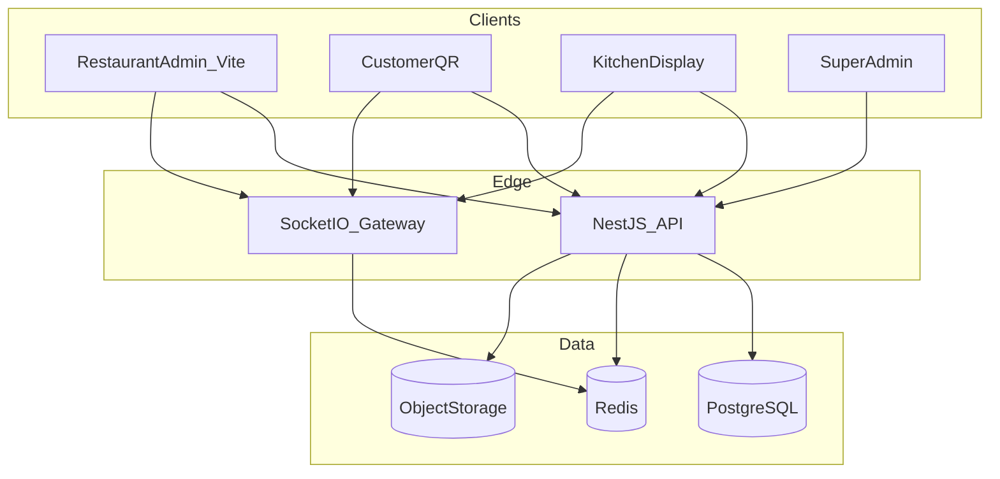

# Architecture overview

Bear 360 is a multi-tenant food OS: Super Admin, restaurant admin, kitchen display, staff PIN portal, and guest QR ordering.

## Containers



## Repo layout

```
apps/web          Vite React UI (was root src/)
apps/api          NestJS + Prisma
packages/shared   Zod DTOs, order transitions, realtime event names
docs/             This documentation tree
docker-compose.yml  Postgres 16 + Redis 7
```

## Multi-tenancy

- **Organization** — billing / account root
- **Restaurant** — venue/branch; all ops rows carry `restaurantId`
- JWT includes `restaurantIds[]`; guards reject cross-tenant access (`403 TENANT_FORBIDDEN`)
- Platform tables (plans flags, shop catalog later) have no restaurant FK

## Auth roles

| Role | Login | Scope |
|------|--------|--------|
| `super` | email/password | Platform |
| `restaurant` | email/password | Owner venues |
| `kitchen` | email/password | KDS venue |
| `staff` | phone + PIN | Module grants |

Access JWT (short TTL) + refresh tokens (rotated, hashed in DB). Staff PIN hashed with argon2.

## Entitlements

Effective features = `plan ∧ industryDefaults ∧ platformFlags` (see `EntitlementsService`). Server is source of truth; UI FeatureGate should eventually call `GET /api/v1/entitlements/:restaurantId`.
