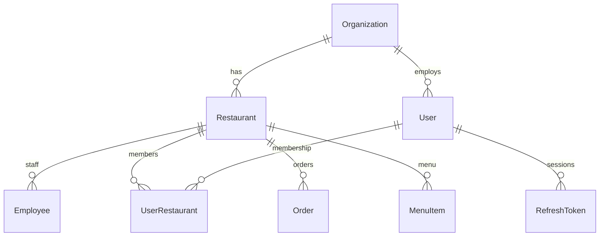

# Data model

Prisma schema: [`apps/api/prisma/schema.prisma`](../apps/api/prisma/schema.prisma)

## Core entities

## Conventions

- Money: `Decimal(12,2)`
- IDs: `cuid()` (restaurant demo seed uses stable `masala-bear` slug/id)
- Soft-delete: planned for menu/staff; not yet on all tables
- Audit: `AuditLog` for critical actions (wire as modules land)

## Seed demo

See [runbooks/local-dev.md](./runbooks/local-dev.md):

- `owner@masala-bear.com` / `password`
- `anya@bear360.app` / `password` (super)
- Staff `9876543210` / PIN `1234` @ `masala-bear`
